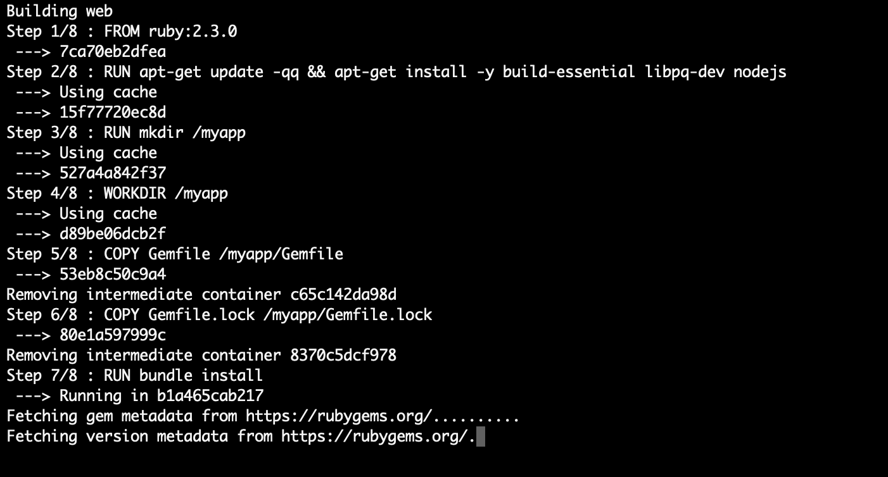
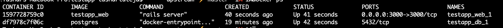

# 🚀 Rails + Postgres with Docker Compose

This repository provides a simple setup for running a **Rails** application with **PostgreSQL**, using **Docker Compose**.

---

## 🛠️ Getting Started

Follow these steps to get the app up and running:

### 1. Install Docker

Make sure Docker is installed on your system. You can download it from Docker's official site: https://www.docker.com/get-started

### 2. Start the Application

Run the following command in your terminal:

    docker-compose up

This will start:

- A **Rails web service** container
- A **PostgreSQL database** container

⏳ The first run may take a few minutes to build the containers.

---

## 🧱 Set Up the Database

Before using the app, you need to create and migrate the database.

### 1. Open a New Terminal

Run:

    docker ps

This will list all running containers.

### 2. Connect to the Web Container

Copy the **Container ID** for the web service and run:

    docker exec -it <container_id> sh

Replace `<container_id>` with your actual container ID.

### 3. Create and Migrate the Database

Inside the container, run:

    rake db:create && rake db:migrate

---

## 🌐 Access the App

Visit http://localhost:3000/ in your browser to see the app running.

---

## ✨ Try Rails Commands

You can run Rails commands inside the container. For example:

    rails g scaffold blog title:string body:string

Then visit http://localhost:3000/blogs to see your scaffolded blog in action.
